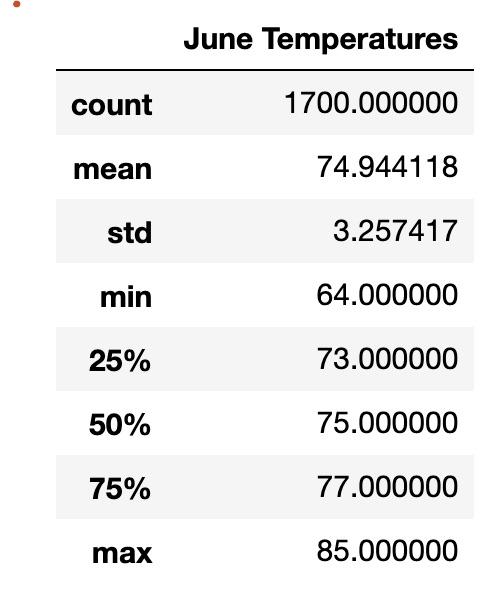
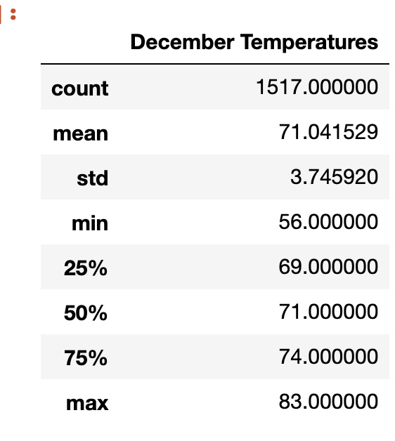
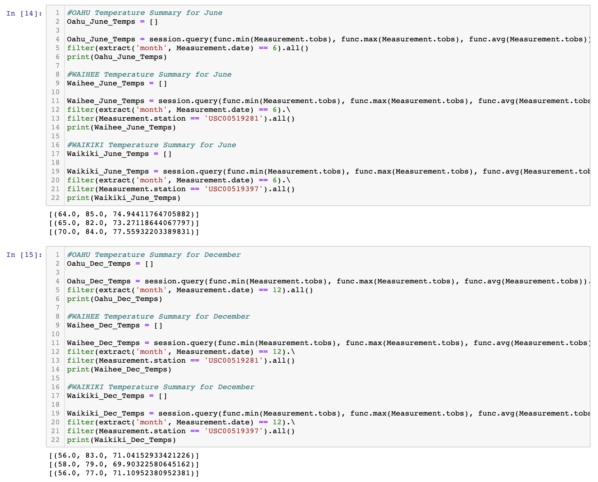
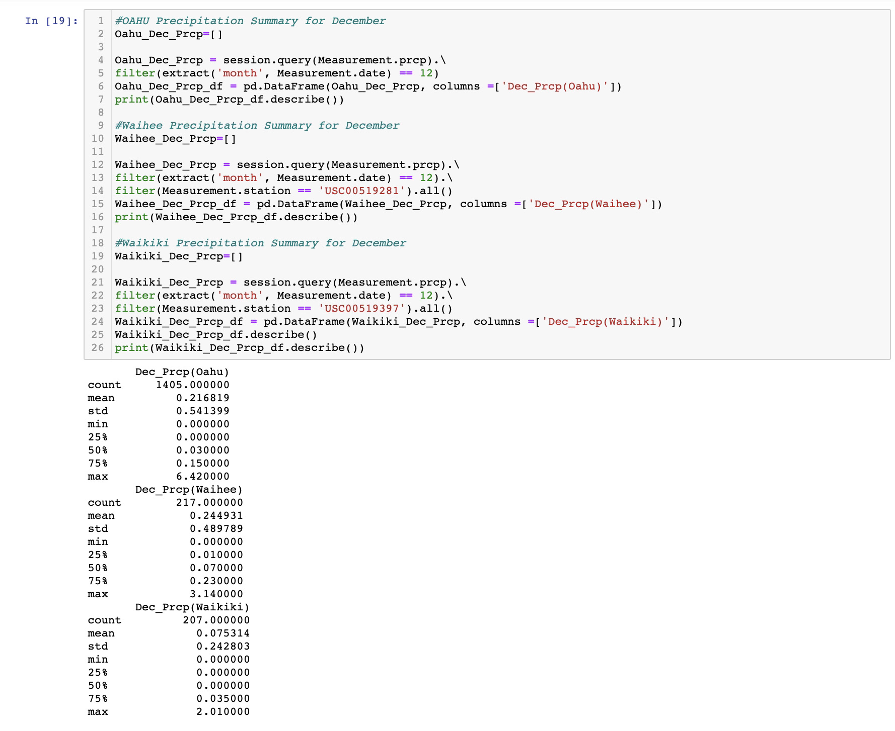

# surfs_up
UCB Bootcamp - Advanced Data Storage and Retrieval

# Overview of the Analysis
The purpose of the analysis is to supply information about the temperature data/trends for the months of June and December in the island of Oahu in Hawaii, to be able to determine if the surf and ice cream shop business is sustainable all year round.

# Results 
The Islands of Hawaii are located in the northern hemisphere, near the Tropic of Cancer, because of it’s location a period of its cold season coincides with the winter season and a period of its warm season coincides with the summer season of the temperate zones of the Northern Hemisphere. However because of Oahu’s varying topography and location, the weather one experiences in any of the  Hawaiian islands very much depends on one’s specific location on the island. 

For this analysis we looked at the temperatures for the two following time frames: June 2010-2017 and December 2010-2016. In the observations below the temperatures are rounded off to the nearest whole number. (The two tables shown below which were the basis for the observations have the numbers as is, and not rounded off)

* The average temperature in Oahu  is 75˚F for the month of June and 71˚ F  for the month of December. 
* The highest temperature recorded in Oahu is 85˚F for the month of June and 83˚ F  for the month of December. 
* The lowest temperature recorded in Oahu is 64˚F for the month of June and 56˚ F  for the month of December. 

# Summary
The weather in the island of Oahu is perfect for opening a surf and ice cream shop. Although the islands of Hawaii are considered as "tropical islands" the "highs", temperature wise, during the summer months are comfortable enough that people can engage in outdoor activities like surfing. The "lows", also temperature wise, are mild enough that people can still go surfing even during the cold months. Those who easily get cold but still determined to surf, could readily purchase whatever wet suits or gear they need to still enjoy surfing.

The location of your business is often critical in its success and because the goal is to have the surf and ice cream shop sustainable year round, it would be better to choose a location in the area known to surfers as the South Shore, rather than the North Shore. The North Shore has amazing waves during the cold months, but that would mean business would also be seasonal. It makes more sense to open a shop along the South Shore of Oahu.

I have written two additional sets of queries; The first set shows us the temperatures of the months of June and December and the second set shows us the precipitation for the same months. The sets of queries differ from the queries done beforehand because, in these sets we  limited or filtered the data from specific weather station.The first weather station, 'USC00519281' or the Waihee Weather Station, produced the most amount of data, which was the preference of the initial investor. I have included another weather station, 'USC00519397'or the Waikiki Weather Station in the set of queries. I will explain why i did so after i have presented all my queries. Just for reference, I have also included the results for the "whole island" of Oahu at the beginning of each set of queries; these  results are the same as those of deliverables 1 and 2 for temperature.

* Query for Temperature, based on Weather Station
    
    Lines 12 and 20 limits the data for the months of June(6) and December (12) only.
    
    Lines 13 and 21 limits the data for the specific weather station 'USC00519281' for Waihee and 'USC00519397' for Waikiki

* Queries for Precipitation, based on Weather Station
    
    Lines 2 to 7 shows us the amount of precipiation for the island of Oahu
    
    Lines 5, 12 and 2s limits the data for the months of June(6) and December (12) only.
    
    Lines 13 and 23 limits the data for the specific weather station 'USC00519281' for Waihee and 'USC00519397' for Waikiki.
    
    Histograms for both June and December are in the resources folder under teh file names June_Prcp and Dec_Prcp
  
 
 

When I was doing the initial analysis for the surf and ice cream shop I got curious about the locations of the different weather stations, also at the same time bearing in mind the possible locations for the shop. I made the preliminary analysis using 'USC00519281' or the Waihee Weather Station, because as preferred by the initial investor it has the most data. It is also found on the "other side" of the South Shore. Most of the "surfable" area of beach(es) this weather station gathers data from is restricted and is for recreational use of military personnel, the other beaches it gathers data from is for surfers with experience or with some experience surfing. Opening a shope here might be a bit risky as one might assume that the surfers going to thede beaches already have the gear they need.

Several beaches that are open to the public for different skill levels of surfing are found along Waikiki... So is a weather station, 'USC00519397'! If the goal is sustainability in terms of business, then Waikiki would be the ideal place for the shop. A lot of surfing schools are found here too, which means that students or people will probably need to rent or purchase their surfing gear or equipment. There is also an opportunity of getting a lot of foot traffic from non-surfers for the ice cream shop especially during the summer! It also looks like Waikiki experience more-rainshower-free days.

If given a chance and I would definitely present the data for Waikiki to the initial investor W. Avy to mull over, before he/we make our presentation to the other investors.
